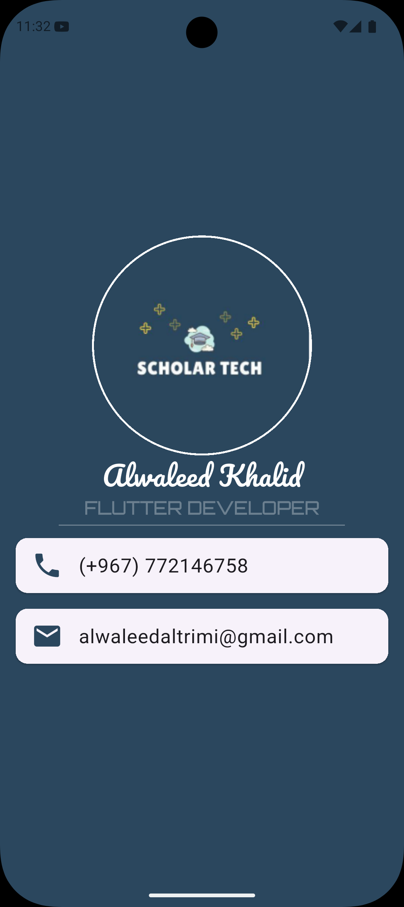

# Business Card App 📱

A professional digital business card application built with Flutter. This app displays contact information in an elegant, modern interface with custom fonts and styling.


## 🖼️ Preview

This app features:
- Professional profile image with circular avatar
- Custom typography using Pacifico and Orbitron fonts
- Contact cards for phone and email
- Responsive design across all platforms
- Beautiful color scheme with gradient effects

## 📷 Screenshots

<div align="center">
  
</div>

## ✨ Features

- **Digital Business Card**: Display your professional information in a modern, clean interface
- **Custom Styling**: Uses custom fonts (Pacifico for names, Orbitron for titles)
- **Contact Integration**: Quick access to phone number and email
- **Cross-Platform**: Runs on Android, iOS, Web, Windows, Linux, and macOS
- **Material Design**: Follows Material Design principles for a polished look

## 🚀 Getting Started

### Prerequisites

- Flutter SDK (version 3.5.4 or higher)
- Dart SDK
- An IDE (Android Studio, VS Code, or IntelliJ IDEA)

### Installation

1. **Clone the repository**
   ```bash
   git clone <repository-url>
   cd busniess_card_app
   ```

2. **Install dependencies**
   ```bash
   flutter pub get
   ```

3. **Run the app**
   ```bash
   flutter run
   ```

## 🎨 Customization

### Update Personal Information

Edit the `lib/main.dart` file to customize your business card:

- **Name**: Change "Alwaleed Khalid" to your name
- **Title**: Update "FLUTTER DEVELOPER" to your profession
- **Phone**: Modify the phone number in the phone Card
- **Email**: Update the email address in the email Card
- **Profile Image**: Replace `images/Alwaleed.png` with your own photo
- **Colors**: Adjust the color scheme by modifying the Color values

### Custom Fonts

The app uses two custom fonts located in the `fonts/` directory:
- **Pacifico**: For the name display
- **Orbitron**: For the title/profession text

To use different fonts:
1. Add your font files to the `fonts/` directory
2. Update the `pubspec.yaml` file with the new font family names
3. Modify the `fontFamily` property in `lib/main.dart`

## 📁 Project Structure

```
busniess_card_app/
├── lib/
│   └── main.dart          # Main application code
├── fonts/                 # Custom font files
│   ├── Pacifico-Regular.ttf
│   └── Orbitron-VariableFont_wght.ttf
├── images/                # Image assets
│   └── Alwaleed.png      # Profile picture
├── pubspec.yaml          # Project configuration
└── README.md            # This file
```

## 🛠 Built With

- [Flutter](https://flutter.dev/) - Cross-platform UI framework
- [Dart](https://dart.dev/) - Programming language
- [Material Design](https://material.io/) - Design system

## 📄 Dependencies

- `cupertino_icons` - iOS-style icons
- `flutter_test` - Testing framework
- `flutter_lints` - Code linting rules

## 🎯 Future Enhancements

Potential features to add:
- Social media links (LinkedIn, Twitter, GitHub)
- QR code generation for easy sharing
- Dark/Light theme toggle
- Multiple language support
- Share functionality
- Editable fields with form input
- Save contact to phone feature

## 📝 License

This project is open source and available for learning and development purposes.

## 👤 Author

**Alwaleed Khalid**
- Flutter Developer
- Email: alwaleedaltrimi@gmail.com
- Phone: (+967) 772146758

## 🤝 Contributing

Contributions, issues, and feature requests are welcome! Feel free to check the issues page if you want to contribute.

## 📞 Support

If you have any questions or need help, feel free to reach out via email at alwaleedaltrimi@gmail.com


